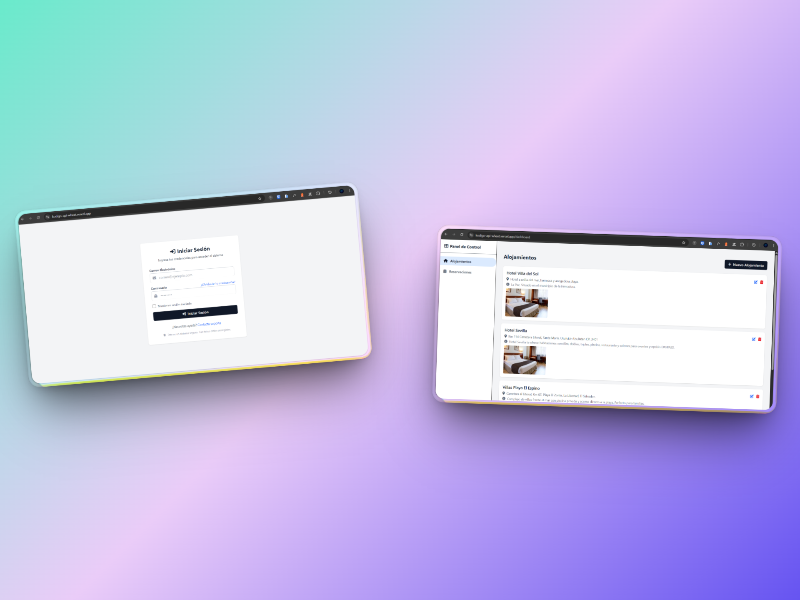
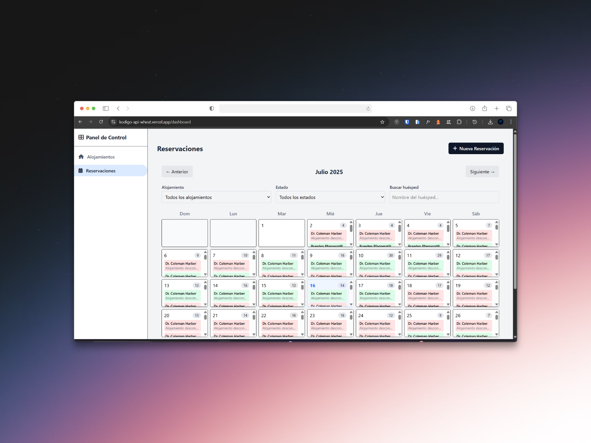
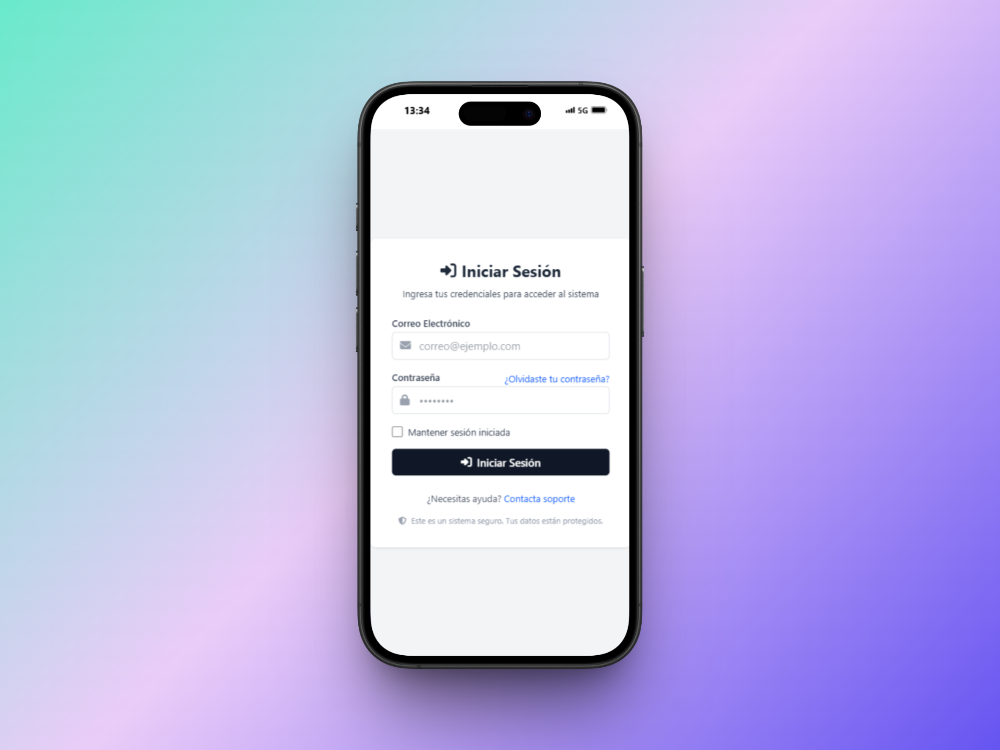

# 🚀 Kodigo API SPA

Kodigo API SPA es una **Single Page Application (SPA) moderna y responsiva** desarrollada con ReactJS, enfocada en el consumo de una **API privada**. La aplicación permite visualizar, gestionar y consultar datos protegidos mediante autenticación, simulando el funcionamiento de paneles administrativos o dashboards profesionales. Este proyecto es ideal para practicar integración de APIs privadas, manejo de autenticación y construcción de interfaces dinámicas.

---

## 🧠 Tecnologías y aprendizajes

- ReactJS con componentes funcionales y hooks  
- Consumo de APIs privadas mediante fetch y manejo de tokens  
- React Router DOM para navegación y rutas protegidas  
- styled-components para diseño personalizado y responsivo  
- React Hook Form para validación y manejo de formularios  
- Modularización del código para proyectos escalables y ordenados  
- Buenas prácticas en la estructura de carpetas y organización del proyecto

---
## 👤 Usuarios de prueba

A continuación, los usuarios de prueba con sus contraseñas hasheadas:

abner95@example.com
$2y$12$uYSt7J5Zwqho9cUpTkWCW.I4OVojaUjwxHMBZs4DBc48xvH.6Rnxa

dicki.alexa@example.org
$2y$12$uYSt7J5Zwqho9cUpTkWCW.I4OVojaUjwxHMBZs4DBc48xvH.6Rnxa

nitzsche.americo@example.net
$2y$12$uYSt7J5Zwqho9cUpTkWCW.I4OVojaUjwxHMBZs4DBc48xvH.6Rnxa

kade40@example.com
$2y$12$uYSt7J5Zwqho9cUpTkWCW.I4OVojaUjwxHMBZs4DBc48xvH.6Rnxa

barbara.kemmer@example.net
$2y$12$uYSt7J5Zwqho9cUpTkWCW.I4OVojaUjwxHMBZs4DBc48xvH.6Rnxa

---

## 👥 Integrantes

- Michael Steven Palacios Aguilar  
- Jonatan Ernesto Segura Reymundo  
- Denys Alexander Hernandez Maravilla  

---

## 🌐 Demo en línea

[Ver proyecto en Vercel](https://kodigo-api-wheat.vercel.app)

---

## 📸 Capturas

  
  

  

